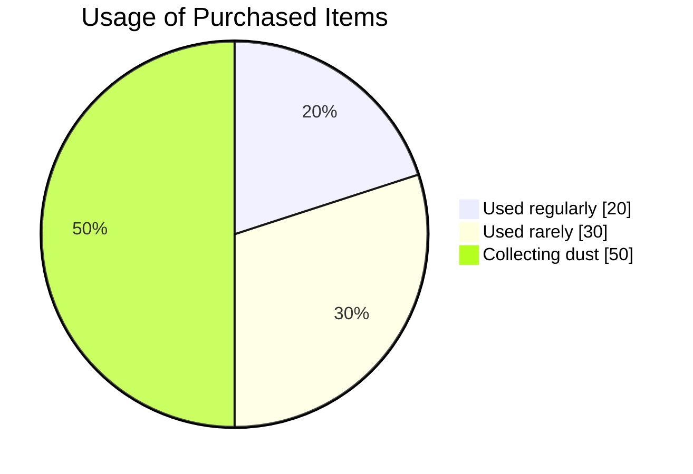

# MINIMUM

## Rental Marketplace for Europe

  
    Airbnb for everything — from cameras to cars
  

  Chisinau, Moldova · 2025

---
layout: two-cols
---

# The Problem

<v-clicks>

### People today:

- 🛒 **Buy** things for one-time use
- 💸 **Spend** money on things needed for a day
- 🏠 **Store** piles of unused items
- 🔍 **Can't find** what they need locally

</v-clicks>

::right::

<v-click>

  <strong>80% of items</strong> are used <strong>less than once a month</strong>

</v-click>

---
layout: center
class: text-center
---

# The Solution

🔄

## Minimum — a platform where anyone can

  

    
📦

    
Rent out

    
Earn from unused items

  

  

    
🎯

    
Rent

    
Pay only for the time you use

  

---

# Why Us?

### 🥇 First on the Market

<v-clicks>

- No competitors in Moldova

</v-clicks>

### 💪 Small Business Support

<v-clicks>

- Photo studios can rent out equipment
- Tool shops — expand their reach
- Event companies — monetize downtime

</v-clicks>

---

# Revenue Model (100%)

<v-clicks>

| Source | Share |
|--------|-------|
| Rental commission | 65% |
| Subscriptions | 15% |
| Premium features | 10% |
| Delivery | 5% |
| Storage | 5% |

</v-clicks>

::right::

---

# Subscriptions

<v-click>

  
🧸

  
Toys

  
For families with children

  
€39/mo

  
6 toys, swap every week

</v-click>

<v-click>

  
🔧

  
Kits

  
For home projects

  
€49/weekend

  
Repairs, cleaning, moving

</v-click>

<v-click>

  
🏢

  
Business

  
For companies

  
€79/mo

  
Unlimited listings, 5% commission

</v-click>

---

# Unique Monetization Models

<v-click>

  

    🚗
    Test Drive
  

  
Rent → Try → Buy

  
Rental fee counts toward purchase

</v-click>

<v-click>

  

    📦
    Storage
  

  
We store → Photograph → Rent out

  
Owner never meets the customer

</v-click>

<v-click>

  

    🚚
    Delivery
  

  
Integration with Glovo

  
20% commission per delivery

</v-click>

<v-click>

  

    🛒
    Marketplace
  

  
Sales + Rentals on one platform

  
10% commission on sales

</v-click>

---
layout: center
---

# Case Study: Flowers for March 8th

<v-click>

  💐

</v-click>

<v-click>

  

    
€5

    
1 hour rental

  

  

    
8

    
rentals per day

  

  

    
€40

    
revenue/day

  

</v-click>

<v-click>

  
50 bouquets × 5 days × €15 profit

  
€3,750

  
from one campaign

</v-click>

---

# Seasonal Campaigns

  
⛷️

  
Winter

  
Skis, snowboards

  
🌷

  
Spring

  
Garden, March 8th

  
🏕️

  
Summer

  
Camping, bicycles

  
🎓

  
Fall

  
School, graduation

<v-click>

  
Viral mechanics:

  

    Rent → Take a photo → Tag @Minimum → Get €10 credit
  

</v-click>

---

# AI Features

<v-click>

  
🤖 Chatbot

  
24/7 support, -60% tickets

</v-click>

<v-click>

  
📝 Auto-descriptions

  
Photo → Professional text

</v-click>

<v-click>

  
🔍 Smart Search

  
"something for a picnic" → relevant items

</v-click>

<v-click>

  
💰 Price Optimization

  
+15-20% to landlord income

</v-click>

<v-click>

  
🛡️ Anti-fraud

  
Protection against scams

</v-click>

<v-click>

  
📊 Demand Forecast

  
What will be popular next month

</v-click>

---
layout: two-cols
---

# Marketing

<v-clicks>

### Acquisition Channels

- 📱 **Social Media** — TikTok, Instagram, Telegram
- 🗣️ **Word of mouth** — best advertising
- 🎁 **Referral program** — €10 for a friend
- 🎓 **Universities** — partnerships
- 🎪 **Events** — local presence

</v-clicks>

::right::

---

# Monthly Investment Breakdown

<v-click>

  

    $10
  

  
Hosting

  
per server

</v-click>

<v-click>

  

    $50
  

  
Domain

  
one-time

</v-click>

<v-click>

  

    $3K
  

  
Marketing

  
main budget

</v-click>

<v-click>

  

    $220
  

  
Development

  
product

</v-click>

---

# Why Now?

<v-clicks>

  
📈

  
Growing Market

  
Sharing economy +25% per year

  
🎯

  
Empty Market

  
No competitors in the region

  
💰

  
Low Costs

  
CAC 5x cheaper than in EU

  
🚀

  
Ready Product

  
MVP works, only need growth

</v-clicks>

---
layout: center
class: text-center
background: https://images.unsplash.com/photo-1556742049-0cfed4f6a45d?w=1920&q=80
---

# Let's Build the Future Together

  Minimum — the sharing economy for Europe

  Chisinau, Moldova · 2025

---
layout: end
---

# Thank You!

  Questions?

