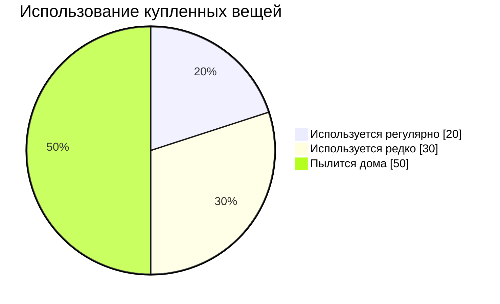

# MINIMUM

## Маркетплейс аренды для Европы

  
    Airbnb для всего — от камер до автомобилей
  

  Кишинёв, Молдова · 2025

---

## layout: two-cols

# Проблема

<v-clicks>

### Люди сегодня:

- 🛒 **Покупают** вещи на один раз
- 💸 **Тратят** деньги на то, что нужно на день
- 🏠 **Хранят** горы неиспользуемых вещей
- 🔍 **Не могут найти** нужное локально

</v-clicks>

::right::

<v-click>

  <strong>80% вещей</strong> используются <strong>менее 1 раза в месяц</strong>

</v-click>

---

layout: center
class: text-center

---

# Решение

🔄

## Minimum — платформа, где каждый может

  

    
📦

    
Сдавать в аренду

    
Зарабатывать на неиспользуемых вещах

  

  

    
🎯

    
Арендовать

    
Платить только за время использования

  

---

# Почему мы?

### 🥇 Первые на рынке

<v-clicks>

- Нет конкурентов в Молдове

</v-clicks>

### 💪 Поддержка малого бизнеса

<v-clicks>

- Фотостудии могут сдавать технику
- Магазины инструментов — расширить охват
- Ивент-компании — монетизировать простой

</v-clicks>

---

# Как зарабатываем из 100%

<v-clicks>

| Источник          | Доля |
| ----------------- | ---- |
| Комиссия с аренды | 65%  |
| Подписки          | 15%  |
| Премиум-функции   | 10%  |
| Доставка          | 5%   |
| Хранение          | 5%   |

</v-clicks>

::right::

---

# Подписки

<v-click>

  
🧸

  
Игрушки

  
Для семей с детьми

  
€39/мес

  
6 игрушек, обмен каждую неделю

</v-click>

<v-click>

  
🔧

  
Наборы

  
Для домашних проектов

  
€49/выходные

  
Ремонт, уборка, переезд

</v-click>

<v-click>

  
🏢

  
Бизнес

  
Для компаний

  
€79/мес

  
Безлимит объявлений, 5% комиссия

</v-click>

---

# Уникальные модели монетизации

<v-click>

  

    🚗
    Тест-драйв
  

  
Арендуй → Попробуй → Купи

  
Арендная плата засчитывается в покупку

</v-click>

<v-click>

  

    📦
    Кладовка
  

  
Храним → Фотографируем → Сдаём

  
Арендодатель не встречается с клиентом

</v-click>

<v-click>

  

    🚚
    Доставка
  

  
Интеграция с Glovo

  
Комиссия 20% с каждой доставки

</v-click>

<v-click>

  

    🛒
    Маркетплейс
  

  
Продажа + Аренда на одной площадке

  
Комиссия 10% с продаж

</v-click>

---

## layout: center

# Кейс: Цветы на 8 марта

<v-click>

  💐

</v-click>

<v-click>

  

    
€5

    
1 час аренды

  

  

    
8

    
аренд в день

  

  

    
€40

    
выручка/день

  

</v-click>

<v-click>

  
50 букетов × 5 дней × €15 прибыли

  
€3,750

  
с одной кампании

</v-click>

---

# Сезонные компании

  
⛷️

  
Зима

  
Лыжи, сноуборды

  
🌷

  
Весна

  
Сад, 8 марта

  
🏕️

  
Лето

  
Кемпинг, велосипеды

  
🎓

  
Осень

  
Учёба, выпускной

<v-click>

  
Механика вирусности:

  

    Арендуй → Сделай фото → Отметь @Minimum → Получи €10 на счёт
  

</v-click>

---

# AI-функции

<v-click>

  
🤖 Чатбот

  
24/7 поддержка, -60% тикетов

</v-click>

<v-click>

  
📝 Авто-описания

  
Фото → Профессиональный текст

</v-click>

<v-click>

  
🔍 Умный поиск

  
«что-то для пикника» → релевантные товары

</v-click>

<v-click>

  
💰 Оптимизация цен

  
+15-20% к доходу арендодателей

</v-click>

<v-click>

  
🛡️ Антифрод

  
Защита от мошенничества

</v-click>

<v-click>

  
📊 Прогноз спроса

  
Что будет популярно через месяц

</v-click>

---

## layout: two-cols

# Маркетинг

<v-clicks>

### Каналы привлечения

- 📱 **Соцсети** — TikTok, Instagram, Telegram
- 🗣️ **Сарафанное радио** — лучшая реклама
- 🎁 **Реферальная программа** — €10 за друга
- 🎓 **Университеты** — партнёрства
- 🎪 **Мероприятия** — локальное присутствие

</v-clicks>

::right::

---

# Распределение инвестиций на месяц

<v-click>

  

    $10
  

  
Хостинг

  
за сервер

</v-click>

<v-click>

  

    $50
  

  
Домен

  
единоразово

</v-click>

<v-click>

  

    $3K
  

  
Маркетинг

  
основной бюджет

</v-click>

<v-click>

  

    $220
  

  
Разработка

  
продукт

</v-click>

---

# Почему сейчас?

<v-clicks>

  
📈

  
Рынок растёт

  
Sharing economy +25% в год

  
🎯

  
Пустой рынок

  
Нет конкурентов в регионе

  
💰

  
Низкие затраты

  
CAC в 5x дешевле чем в EU

  
🚀

  
Готовый продукт

  
MVP работает, нужен только рост

</v-clicks>

---

layout: center
class: text-center
background: https://images.unsplash.com/photo-1556742049-0cfed4f6a45d?w=1920&q=80

---

# Давайте строить будущее вместе

  Minimum — экономика совместного потребления для Европы

  Кишинёв, Молдова · 2025

---

## layout: end

# Спасибо!

  Вопросы?

